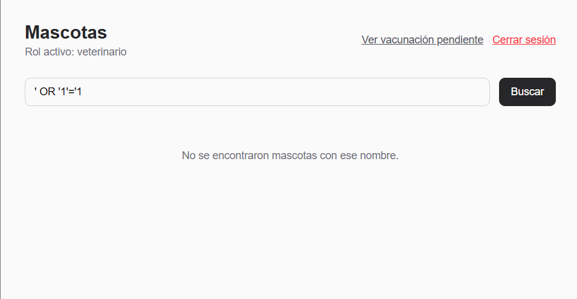
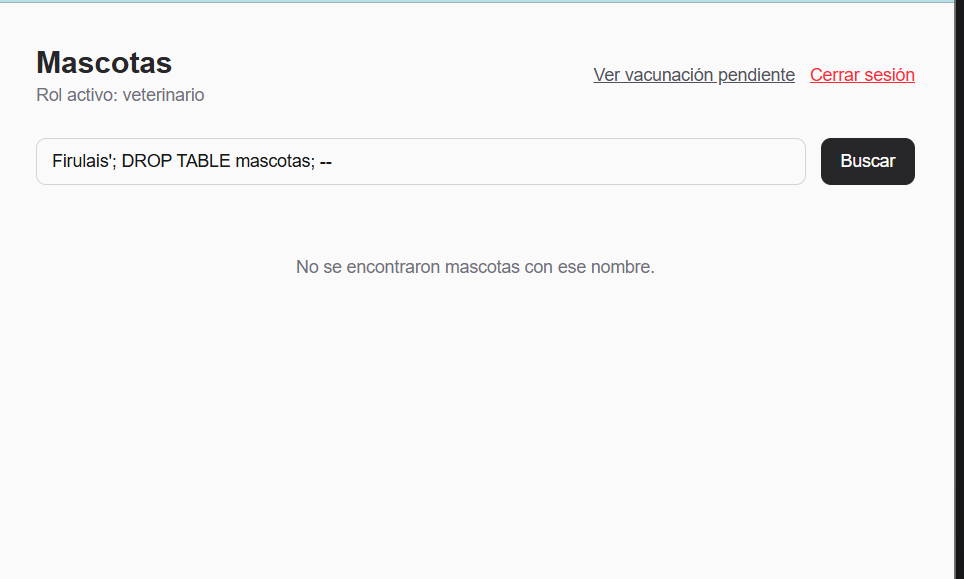
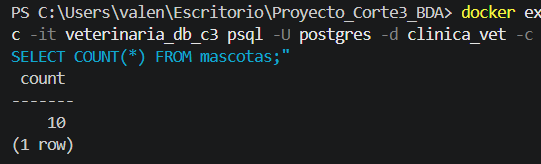
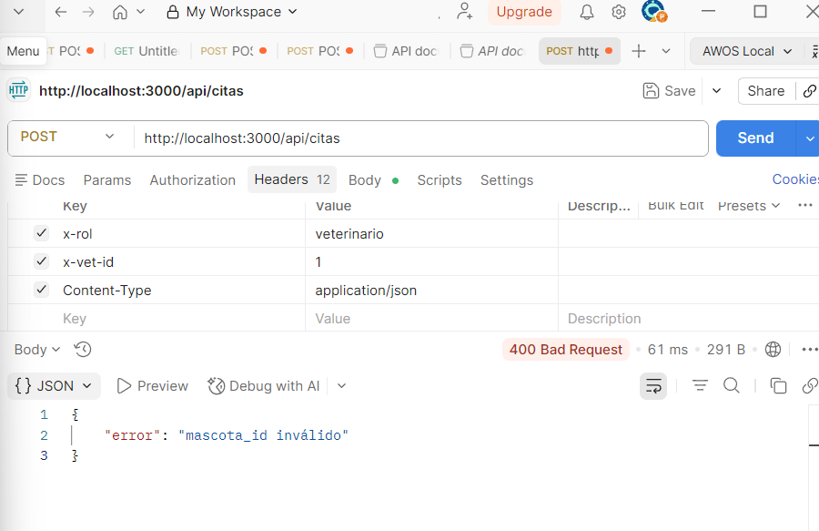
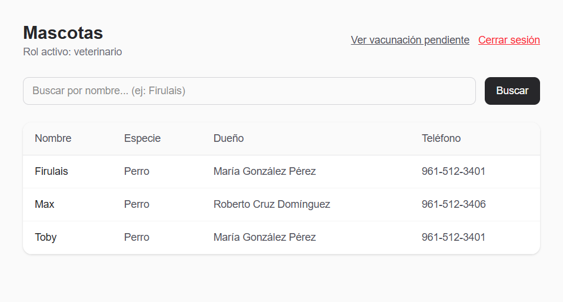
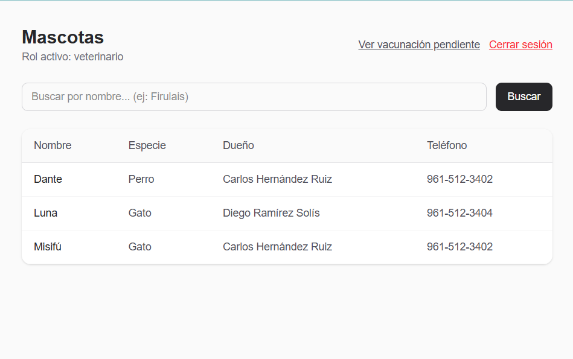
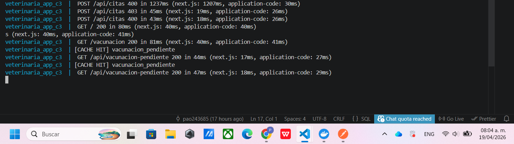
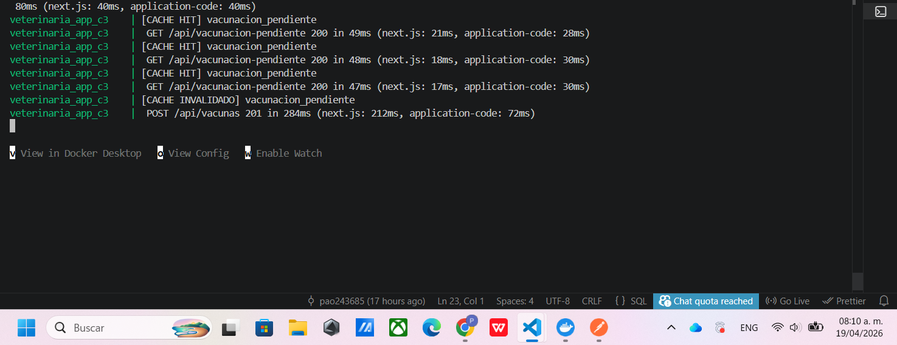
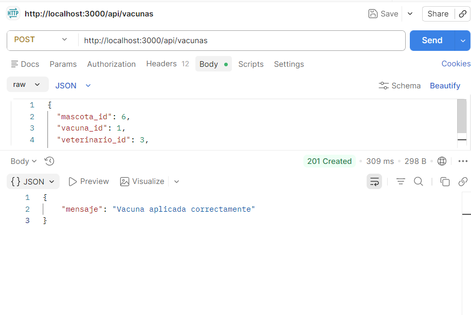
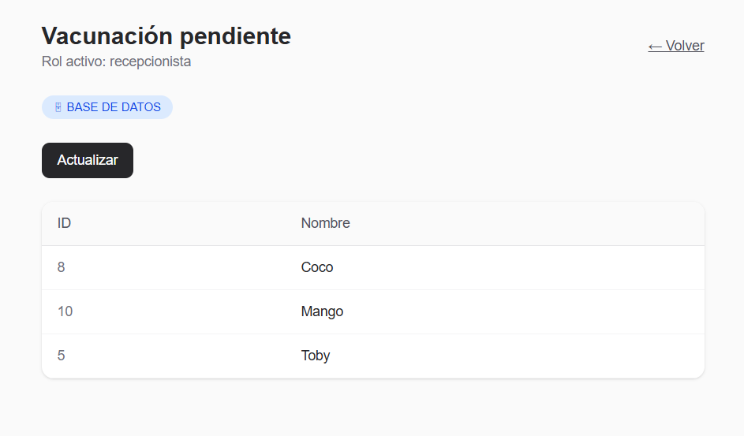

# Cuaderno de ataques — Corte 3
**Alumno:** Paola Esmeralda Valencia Aguilar
**Matrícula:** 243685
**Sistema:** Clínica Veterinaria — PostgreSQL + Redis + Next.js

---

## Sección 1: Tres ataques de SQL injection que fallan

### Ataque 1 — Quote-escape clásico

**Input probado:** `' OR '1'='1`

**Pantalla:** Campo "Buscar por nombre" en `/mascotas`

**Por qué falla:**  
El endpoint construye la query con un parámetro vinculado `$1`. El driver `pg` 
envía el valor como dato binario separado del SQL — Postgres nunca lo interpreta 
como código. El input se busca literalmente como texto `%' OR '1'='1%` 
contra el campo `nombre`, y no encuentra ninguna mascota.

**Línea exacta que defiende:**  
`src/app/api/mascotas/route.ts` — línea donde se construye el query:
```typescript
const result = await client.query(
  `SELECT ... WHERE m.nombre ILIKE $1 ...`,
  [`%${nombre}%`]   // ← el valor nunca se concatena al SQL
);
```

**Resultado:** 0 mascotas devueltas. No hay error, no hay fuga de datos.



---

### Ataque 2 — Stacked query

**Input probado:** `Firulais'; DROP TABLE mascotas; --`

**Pantalla:** Campo "Buscar por nombre" en `/mascotas`

**Por qué falla:**  
Las queries parametrizadas no permiten múltiples statements. El `;` y todo 
lo que sigue son parte del valor `$1`, no del SQL. Postgres recibe una sola 
query con el valor literal `%Firulais'; DROP TABLE mascotas; --%` como 
patrón de búsqueda. La tabla `mascotas` no se toca.

**Línea exacta que defiende:**  
Misma que el Ataque 1 — `src/app/api/mascotas/route.ts`, el `$1` parametrizado.

**Resultado:** 0 mascotas devueltas. La tabla sigue intacta.




---

### Ataque 3 — Manipulación de tipos en el body

**Input probado** (via curl o Postman contra `/api/citas`):
```json
{
  "mascota_id": "1; DROP TABLE citas; --",
  "veterinario_id": 1,
  "fecha_hora": "2026-04-25T10:00:00",
  "motivo": "test"
}
```

**Pantalla:** Endpoint `POST /api/citas` (se puede probar con curl)

**Por qué falla:**  
Antes de llegar a la BD, el backend convierte `mascota_id` con `Number()`.  
`Number("1; DROP TABLE citas; --")` devuelve `NaN`.  
Luego `Number.isInteger(NaN)` es `false`, así que el endpoint responde 
`400 mascota_id inválido` sin tocar la base de datos.

**Línea exacta que defiende:**  
`src/app/api/citas/route.ts`:
```typescript
const mascotaId = Number(body.mascota_id);          // NaN
if (!Number.isInteger(mascotaId) || mascotaId <= 0) // true → rechaza
  return NextResponse.json({ error: 'mascota_id inválido' }, { status: 400 });
```

**Resultado:** HTTP 400 antes de ejecutar ninguna query.



---

## Sección 2: Demostración de RLS en acción

**Setup:** Dos veterinarios con mascotas distintas según `vet_atiende_mascota`:
- `vet_id = 1` (Dr. López): Firulais, Toby, Max
- `vet_id = 2` (Dra. García): Misifú, Luna, Dante

**Prueba 1 — Dr. López:**  
Login con rol `veterinario`, veterinario `Dr. Fernando López Castro`.  
Búsqueda con campo vacío (devuelve todas las visibles para este rol).  
Resultado: solo aparecen **Firulais, Toby, Max**.



**Prueba 2 — Dra. García:**  
Cerrar sesión. Login con rol `veterinario`, veterinario `Dra. Sofía García Velasco`.  
Misma búsqueda con campo vacío.  
Resultado: solo aparecen **Misifú, Luna, Dante**.



**Política RLS que produce este comportamiento:**
```sql
CREATE POLICY vet_ve_sus_mascotas
ON mascotas FOR SELECT TO veterinario
USING (
    id IN (
        SELECT mascota_id FROM vet_atiende_mascota
        WHERE vet_id = current_setting('app.current_vet_id', true)::INT
          AND activa = TRUE
    )
);
```
Cada query que ejecuta el rol `veterinario` sobre `mascotas` pasa por esta 
política. Solo devuelve filas donde el `id` aparece en `vet_atiende_mascota` 
para el `vet_id` que el backend seteó con `SET LOCAL app.current_vet_id`.

---

## Sección 3: Demostración de caché Redis funcionando

**Key usada:** `vacunacion_pendiente`  
**TTL:** 300 segundos (5 minutos)  
**Estrategia de invalidación:** DELETE explícito en `POST /api/vacunas` 
después de COMMIT exitoso.

**Por qué 5 minutos:**  
La vista recorre todas las mascotas y sus vacunas — es la query más cara 
del sistema. Los datos cambian solo cuando se aplica una vacuna nueva, 
lo cual no ocurre cada segundo. 5 minutos balancea frescura y rendimiento: 
si nadie vacuna, la cache sigue siendo válida; si alguien vacuna, 
se invalida inmediatamente.

### Secuencia de logs (con timestamps):

**Consulta 1 — CACHE MISS:**



**Consulta 2 inmediata — CACHE HIT:**



**Aplicar vacuna — invalidación:**



**Consulta 3 post-invalidación — CACHE MISS de nuevo:**

